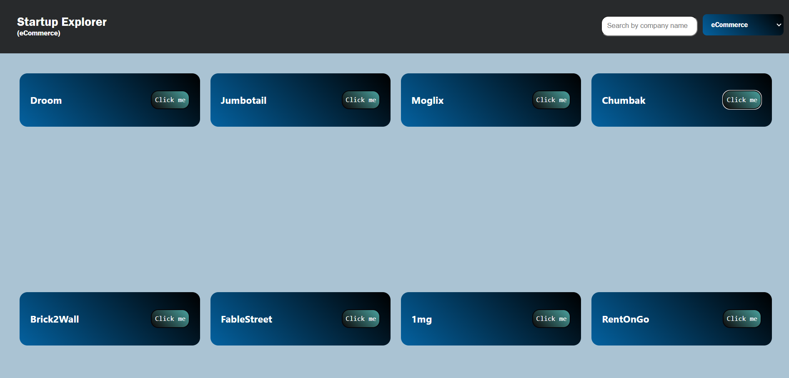
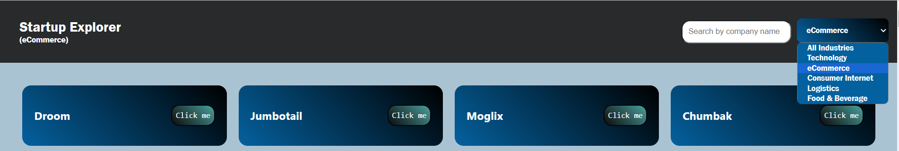
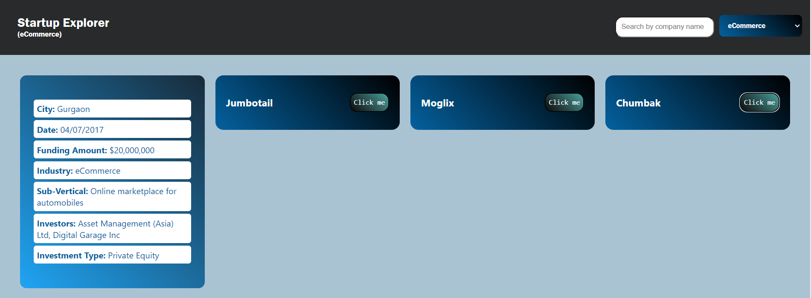

 <h1> <a href="https://startup-world-directorys.netlify.app/" target="_blank"> Welcome to the Startup Directory Web App!👨🏽‍💻🌐</a></h1>

  <h4>Are you considering investing in stocks and seeking a platform that provides comprehensive details about startups across various industries? 🤔
    
Look no further! The Startup Directory is your one-stop destination for all things related to startups.1️⃣
</h4>
  
Our web app offers an interactive platform for visitors to effortlessly view, sort, and explore startup data. Whether you're an investor, entrepreneur, or simply curious about emerging businesses, the Startup Directory provides a wealth of information about each company, including crucial details such as company name, city, funding amount, number of employees, industry, and founders.

   
 Invest wisely by leveraging the power of information with the Startup Directory Web App. Explore and discover the perfect stocks tailored to your preferences. Let the journey to informed investments begin!🚀

  <h1>Preview UI</h1>

  <h2>Frontend</h2>
  
The frontend of the Startup Directory Web App is built with <a href="https://reactjs.org/" target="_blank">React.js</a>.

  
Create a visually appealing grid of startup cards on the home page. Each card showcases Company Name, City, Starting Year, and Funding Amount.

  

  <h3>Detailed View UI</h3>
  
Clicking on a startup card opens a popup with a detailed view, presenting all available data in a user-friendly and presentable way.

  

  <h3>Filtering</h3>
  
Implement a dropdown menu for filtering the list of startups based on Industry Type/Domain attribute.

  

  <h2>Backend</h2>
  
The backend of the Startup Directory Web App is built with <a href="https://expressjs.com/" target="_blank">Express.js</a> and <a href="https://nodejs.org/" target="_blank">Node.js</a>.

  <h1>Usage Guidelines</h1>

  <h2>Explore Startups</h2>
  <ul>
    <li>Navigate to the web app and browse the visually appealing grid of startup cards on the home page. 🏠</li>
    <li>Click on a startup card to view detailed information in a popup, including company name, city, starting year, founders, industry, number of employees, and funding amount. 📊</li>
  </ul>

  <h2>Filter Startups</h2>
  <ul>
    <li>Use the industry filtering dropdown to narrow down the list of startups based on specific industry types or domains. 🧐</li>
    <li>Experiment with different filters to find startups that match your investment criteria. 🔄</li>
  </ul>

  <h2>Contribute</h2>
  <ul>
    <li>If you have valuable insights about startups or want to contribute to the project, follow the contribution guidelines outlined in the repository. 🤝</li>
  </ul>

  <h2>Report Issues</h2>
  <ul>
    <li>Encountered a bug or have suggestions for improvement? Report issues on the GitHub repository's issue tracker. 🐛</li>
  </ul>

  <h2>Stay Updated</h2>
  <ul>
    <li>Keep an eye on the repository for updates, new features, and enhancements. 🚀</li>
  </ul>

  <h1>Setup Instructions</h1>

  <h2>Prerequisites</h2>
  
Make sure you have the following installed:

  <ul>
    <li>Node.js: <a href="https://nodejs.org/" target="_blank">Download and install Node.js</a> 🚀</li>
  </ul>

  <h2>Clone the Repository</h2>
  
    git clone https://github.com/your-username/startup-directory-web-app.git
    cd startup-directory-web-app
  

  <h2>Install Dependencies</h2>
  
    # Install backend dependencies
    cd backend
    npm install

    # Install frontend dependencies
    cd ../frontend
    npm install
  

  <h2>Configure Backend</h2>
  <ol>
    <li>Locate the index.js file in the backend directory.</li>
  </ol>

  <h2>Start the Application</h2>
  
    # Start the backend server
    cd backend-project 
    node index.js

    # Start the frontend development server
    cd ../frontend
    npm start
  

  
Visit <a href="http://localhost:3000" target="_blank">http://localhost:3000</a> in your web browser to access the Startup Directory Web App. 🌐

  <li>Keep an eye on the repository for updates, new features, and enhancements. 🚀</li>

  
Enjoy exploring the Startup Directory Web App and making informed decisions for your investment journey! 🌟

